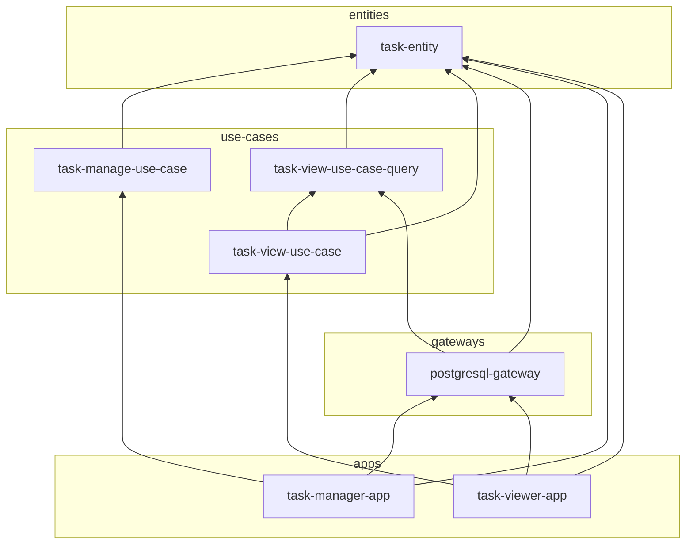

# clean-architecture-spring-boot-example

クリーンアーキテクチャ + Spring Boot の実装例です  
クリーンアーキテクチャの依存ルールを守らせるためのモジュール構造としています

## Module Structure


- A → B は依存の方向 (A が B に依存する)

## Module Summary
<table>
  <tbody>
    <tr>
      <th>task-entity</th>
      <td>TaskEntity と、それの保存・取得の interface を提供</td>
    </tr>
    <tr>
      <th>task-manage-use-case</th>
      <td>タスク管理の use-case を提供 (use-case の実装クラスも配置)</td>
    </tr>
    <tr>
      <th>task-view-use-case</th>
      <td>タスク一覧参照の use-case を提供 (use-case の実装クラスも配置)</td>
    </tr>
    <tr>
      <th>task-view-use-case-query</th>
      <td>
        task-view-use-case 用のクエリの interface を提供<br>
        task-view-use-case 内にクエリ inteface を置くことも可能だが、別モジュールにすることで task-view-use-case の依存モジュール (= task-viewer-app) からクエリ inteface を参照できないようにできる<br>
      </td>
    </tr>
    <tr>
      <th>postgresql-gateway</th>
      <td>
        Entity の保存・取得 interface と use-case 用クエリ interface を実装<br>
        このモジュールを実行するためには spring boot r2dbc のシステムプロパティ設定が必要 (通常、アプリモジュールの application.yml 等で記述)<br>
      </td>
    </tr>
    <tr>
      <th>task-manager-app</th>
      <td>タスク管理アプリ</td>
    </tr>
    <tr>
      <th>task-viewer-app</th>
      <td>タスク一覧参照アプリ</td>
    </tr>
  </tbody>
</table>

## Usage

1. 開発用インフラの起動
   ```shell
   ./gradlew dev-infra:composeUp
   ```
   - 5432 ポートを DB が使用

2. task-manager-app の実行
   ```shell
   ./gradlew apps:task-manager-app:bootRun
   ```
   - ランダムポートのため、起動時のログを確認
   - タスクの登録
     ```
     POST http://localhost:{ポート}/tasks
     { "title": "task1" }
     ```
   - 登録したタスクの確認
     ```
     GET http://localhost:{ポート}/tasks/{タスクID}
     ```
   - タスクの完了
     ```
     PUT http://localhost:{ポート}/tasks/{タスクID}/complete
     ```

3. task-viewer-app の実行
   ```shell
   ./gradlew apps:task-viewer-app:bootRun
   ```
   - ランダムポートのため、起動時のログを確認
   - タスク一覧を表示
     - すべてのタスク `GET http://localhost:{ポート}/tasks`
     - 完了済タスク `GET http://localhost:{ポート}/tasks?completed=true`
     - 未完了タスク `GET http://localhost:{ポート}/tasks?completed=false`
